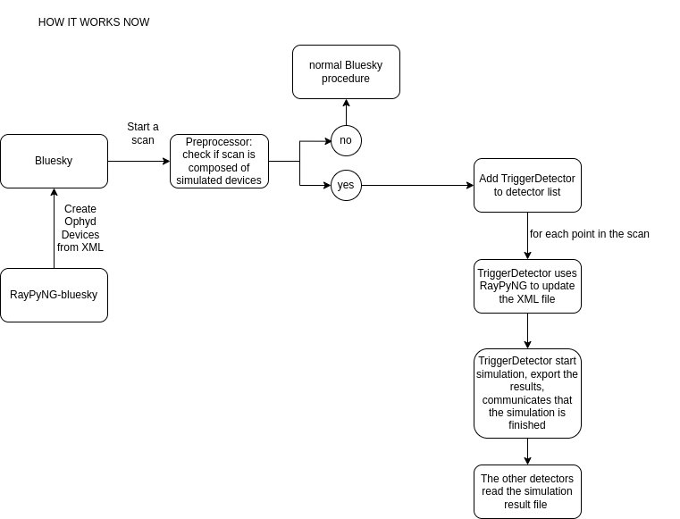

# Digital Twin

## Introduction
This is the project used to develop the digital-twin project. Cloning this directory and running 

## Getting Started
Run 

```bash
install.sh
``` 

The script is doing the followng:
1. Create a python environment called .venv 
2. install `xvfb`, a library used to hide the graphical user interface of RAY-UI.
3. Update the submodules `raypyng` and `raypyng-bluesky` 
4. Install in `raypyng`, `raypyng-bluesky`, and `beamlinetools` in `.venv` with the flag -e (the changes done in the source code of the three packages will be immediately available in ipython/python)
5. Install ipython

Make sure you have RAY-UI installed, possibly in the home folder. If you don't, there is an installer in the RAY-UI folder. Make sure the file is executable and run it.

## Bluesky
We use bluesky via an ipython profile, in this case `profile_raypyng`. Normally in the startup folder of an ipython profile there are files that are loaded before running the ipython session. In this case the startup file is loading the content of `beamlinetools/BEAMLINE_CONFIG`. 

The digital twin is configured in the file `beamlinetools/BEAMLINE_CONFIG/digital_twin.py`. The rml file that is loaded is in the rml folder in this project, by default the `rml/elisa.rml` file is used.

### Bluesky concepts to get familiar with
1. [Bluesky Project](https://blueskyproject.io/) website
2. The [RunEngine](https://blueskyproject.io/bluesky/tutorial.html#the-runengine)
3. A [plan](https://blueskyproject.io/bluesky/tutorial.html#simulate-and-introspect-plans) in Bluesky.
4. The [Preprocessors](https://blueskyproject.io/bluesky/plans.html#plan-preprocessors)
5. [Ophyd](https://blueskyproject.io/ophyd/), in particular [signals](https://blueskyproject.io/ophyd/user/reference/signals.html) and how to group them into [devices](https://blueskyproject.io/ophyd/user/tutorials/device.html#)

## How does it work?
Two python packages are used to create a digital twin. The first one is [raypyng](https://raypyng.readthedocs.io/en/latest/index.html), this is basically a python API to RAY-UI. The second one is [raypyng-bluesky](https://raypyng-bluesky.readthedocs.io/en/latest/index.html)that is responsible for the integration into bluesky.

This is a schematic of what is happening now.



For the user is enough to include this line of code in the startup files:

```python
RaypyngOphydDevices(RE=RE, rml_path=rml_path, temporary_folder=None, name_space=None, prefix=None, ray_ui_location=None)
```

Behind the scenes, `raypyng` reads the rml files and we use the [RMLFile class](https://raypyng.readthedocs.io/en/latest/API.html#rmlfile) to create python objects. We use then the python objects to create ophyd devices, see the [RaypyngOphydDevices class of raypyng-bluesky](https://raypyng-bluesky.readthedocs.io/en/latest/API.html#raypyngophyddevices). This devices are then available in the ipython session, with the prefix `rp_`. >For instance, if in the rml file is present a Dipole called `D1`, it will be available in the ipython session as `rp_D1`.

Scans can be done as normally in bluesky, but it is forbidden to mix simlated and real devices. Once a scan is started, we use a preprocessor to modify the plan on the fly. In particular:
1.  a trigger detector is added to the detector list, in the first position (so that it is triggered first). 
2. The trigger detector, at each point of the scan, reads the position of all the simulated devices, and it updates the rml file by saving it in a temporary folder. 
3. It starts the simulation using RAY-UI, exports the results when done (multiple detector can be used, results are exported for each detector). It communicates that the simulations are done to the other detectors. 
4. The other detectors read the result files. 

## Using a server
I am testing some extensions to be able to send the simulations on to do on a server. The work is available on the branch `1022-client`

## Usage
Start the ipython profile by running 

```bash
./start.sh
```
This will start the ipython profile with bluesky and the digital twin. Try  a scan:

```python
RE(scan([rp_DetectorAtFocus.intensity],rp_Dipole.en,500,2000,10))
```

## How to develop
Each project has two main branches, `main` and `develop`. I want to implement [this workflow](https://hzb-controls-wiki.readthedocs.io/en/external/Introduction/git_workflow/#main-and-develop-branches-for-features-integration) in the near future.
